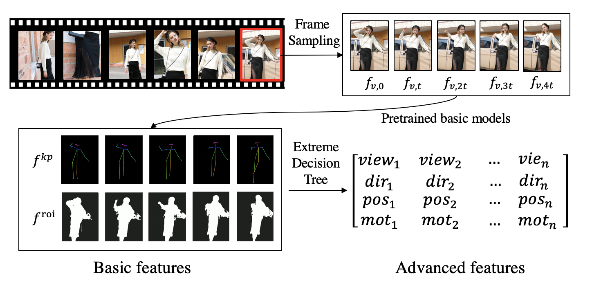
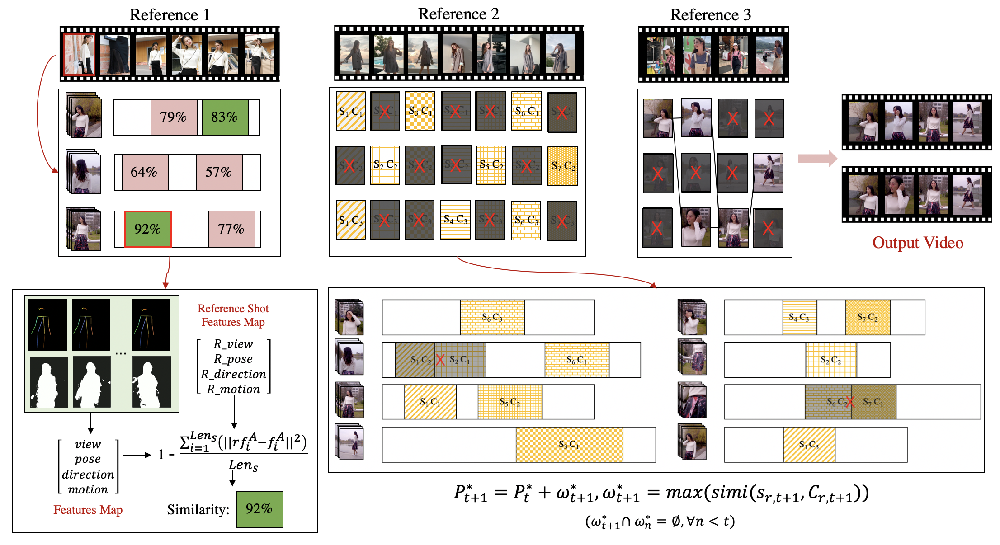
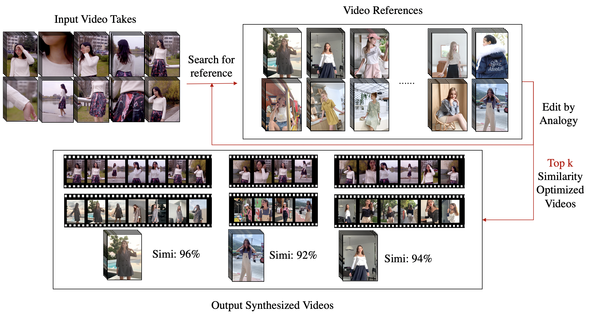

# 飞影 Cut Mins - 剪辑算法模块


剪辑算法模块使用python实现的绝大部分剪辑相关的算法。

## 内容 Contents
1. [结果-Results](#1-结果-results)
2. [依赖-Requriements](#2-依赖-requriements)
3. [快速测试-Quick-Test](#3-快速测试-quicktest)
4. [算法细节-Details](#4-算法细节-details)
5. [相关工作-Related-Work](#5-相关工作-relatedwork)
6. [参考文献-Citation](#6-参考文献-citation)
7. [License](#license)

## 1-结果 Results

在处理一段3min的视频素材时，剪辑算法的效率量化如下：

|  剪辑环节   | 花费时间  |
|  ----      |  ----    |
|  视频转码   |   5s     |
|  YOLO v3   |   52s    |
|  AlphaPose |   1m39s  |
| 高维特征提取 |   3s     |
|  案例搜索   |   21s    |
|  案例渲染   |   48s    |
|  合计时间   |  3m40s   |

最后输出若干段（按预先设置，一般为10段）10-30s的针对不同案例的剪辑结果。

## 2-依赖 Requriements
  - `pip install`:
    - `chardet` ==3.0.4
    - `dask` ==2.9.1
    - `idna` ==2.8
    - `imageio-ffmpeg` ==0.3.0
    - `jsonpatch` ==1.26
    - `jsonpointer` ==2.0
    - `moviepy` ==1.0.1
    - `nibabel` ==3.1.1
    - `prettytable` ==0.7.2
    - `proglog` ==0.1.9
    - `psutil` ==5.6.7
    - `pyzmq` ==19.0.1
    - `requests` ==2.22.0
    - `scikit-video` ==1.1.11
    - `slidingwindow` ==0.0.13
    - `torch` ==1.3.1
    - `torchfile` ==0.1.0
    - `torchsample` ==0.1.3
    - `tqdm` ==4.41.1
    - `urllib3` ==1.25.7
    - `visdom` ==0.1.8.9
    - `websocket-client` ==0.57.0
    - `xgboost` ==0.90

## 3-快速测试 QuickTest

### 3.1-功能测试脚本

- `test/`: 包含了测试的脚本、素材样例、案例
    - `aly-test.py`: 测试视频特征提取，包含ROI特征，Alphapose等。主要调用了`analyze.py`中的函数内容。
    - `cho_test.py`: 测试序列生成，主要调用了`choose.py`的函数内容。
    - `cut_test.py`: 测试候选镜头生成。主要调用了
    - `pp_test.py`: 测试视频预处理,包含转码、压缩等
    - `red_test.py`: 测试序列生成以及渲染成片
    - `videos/`:包含了五组测试输入素材
    - `templates/`: 包含了四组测试案例

测试方法：
```bash
python test.py
```
该py文件将会调用unittest.TestSuite，对预处理模块`pp_suite`，特征编码模块`aly_suite`，剪辑模块`cut_suite`、`cho_suite`，以及渲染模块`red_suite`进行批量测试。

```python
alltests = unittest.TestSuite([pp_suite, aly_suite, cut_suite, cho_suite, red_suite])
```

### 3.2-核心调用文件
> 点击可进入对应模块的算法细节说明
- `preprocess.py`：[预处理模块](#41-预处理模块)的主要代码。素材预处理模块主要负责对输入素材进行规范化，通常会进行格式转码，大小压缩等操作，提取出素材对象;
- `analyze.py`：[特征编码](#42-特征编码)模块的主要代码。用于分析计算视频的特征；
- `cut.py`: [剪辑模块](#43-剪辑模块)的主要代码。用于预处理视频，指定案例镜头对输入素材视频进行预先划分。
- `choose.py`：[剪辑模块](#43-剪辑模块)的主要代码。用于最优路径选择，相似度分数计算；
- `search.py`: [搜索模块](#44-搜索模块)的主要代码。搜索合适案例，以供剪辑。
- `render.py`: [渲染模块](#45-渲染模块)的主要代码。将视频序列`vshots_line`渲染成可预览视频。
- `api.py`：平台需要的二次开发API；


### 3.3-依赖文件组织

除了核心文件外，为了确保您对算法依赖文件有大致的了解，其余文件组织罗列如下：

- `classes`:剪辑算法中用到的类;
    - `editor_project.py`: 剪辑任务，对不同的请求创建不同的剪辑任务，方便管理每一次的剪辑素材、剪辑过程、剪辑结果;
    - `editor_shot.py`: 剪辑视频的子镜头，用于保存输出视频之前的每一个镜头定位;
    - `path.py`：生成视频时的子镜头路径，将`最优镜头序列生成问题`转化为`选取最优路径问题`;
    - `shot_line.py `: 生成的未渲染视频序列，是从最优路径中取出的视频序列，用于进行后续分析、预览、渲染;
    - `tshot.py`: template的子镜头;
    - `vshot.py `: 剪辑时，针对某个特定的tshot生成的素材shot。包含了素材的来源、起始帧与结束帧。一般地，vshot的长度与其对应的tshot相同;
    - `tshot_bag.py`: 某个文件夹下的所有tshots，方便批量导入template下所有子镜头; 
    - `shot_group.py`: 候选镜头类，将输入视频针对指定tshot生成候选shots;
    - `video.py`: 视频素材类，为每个视频创建一个对象，方便进行文件名存储、类型检查与转换; 
    - `frame.py `: 帧的数据结构，包含了帧级别的特征；

- `data`: 算法运行过程中，一些预先保存好的数据文件，方便直接取用。目前是一些计算reference之间[兼容距离](#4.4.1-兼容距离)的数据。
    - `direct.csv`: 各个templates之间`模特朝向`的相似度关系。
    - `pose.csv`: 各个templates之间`模特动作`的相似度关系。
    - `view.csv`: 各个templates之间`景别`的相似度关系。
    - `motion.csv`: 各个templates之间`运动强度`的相似度关系。
    
- `lib`：目前用到的依赖库。
    - `AlphaPose`: 用于进行骨骼点提取，是当下极为优异且快速的提取模型。
    - `ROI`: 使用YOLO v3进行主体位置的提取，记为ROI数据。
    
- `model`：保存了一些预训练模型。通过机器学习，将上述的骨骼点以及ROI信息转变为四个高维特征：景别、运动强度、人物朝向、人物动作。
- `.gitignore`：用于忽略目录下一些文件的git配置文件；
- `tools`：工具类，其中包含了一些函数接口，方便api调用；
    - `alphapose.py`: 对整个视频调用alphapose提取骨骼点的工具。
    - `yolo.py`:对整个视频调用yolo提取roi信息的工具。
    - `feature.py`:对整个视频的骨骼点、roi特征作进一步计算，得到高维特征的工具。
    - `rid.py`: 获得random id的工具
    - `match_result.py`: 对特定任务的生成视频结果作存储、加载的工具。
    - `progress.py`: 对指定id的任务作初始化以及赋值的工具

## 4-算法细节 Details

核心算法共三部分，分别为`特征编码(Encoding Module)`,`剪辑模块(Editing Module)`,`搜索模块(Search Module)`，系统按下图逻辑运行。

<p align='center'>
    
</p>

### 4.1-预处理模块


> 本模块用于输入素材的预处理。主要预处理流程包括视频转码、视频帧采样。

- `input`: 商家上传的原始输入素材。
- `output`: 转码后的视频素材，采样帧。

该模块的主要函数都在`preprocess.py`中。
- `pp_videos()`函数对输入素材进行预处理：

```python
def pp_videos(folder, taskId=None)
    # @param folder: 待处理视频文件夹
    # @param taskId: 该任务的taskID,在测试时一般不需要。
    # @return: 类型为list,包含了预处理后的视频Video类。
   
```
- `pp_template_videos()`函数对案例视频进行预处理：

```python
def pp_template_videos(folder)
    # @param folder: 待处理案例视频文件夹
    # @param taskId: 该任务的taskID,在测试时一般不需要。
    # @return: 类型为list,包含了预处理后的案例Video类。
   
```

下面将分功能进行关键函数说明。

#### 4.1.1-视频转码

在对视频生成Video类时，会调用Video类里的成员函数`Video.check()`,`Video.convert()`.


```python
# 在 Video.check()中，将进行视频的编码格式提取，以确定后续的预处理过程。
codec = int(cap.get(cv2.CAP_PROP_FOURCC))
```

```python
# 在 Video.convert()中，将各类型的视频转为mp4-h264编码格式，并删除原文件
        cmd = "ffmpeg -i {} -s {}x{} -r {} -vcodec libx264 -preset veryfast {}".format(
            src, self.width, self.height, self.fps, dst)
        print(cmd)
        ret = os.system(cmd)

```
#### 4.1.2-视频帧采样

在对视频生成Video类时，会调用Video类里的成员函数`Video.init_frames()`:
```python
 def init_frames(self, sample_time_interval):
 # @param sample_time_interval: 采样间隔
 # 无返回值，直接将指定间隔的采样帧保存至对象中
```

### 4.2-特征编码


> 本模块用于输入素材的特征编码。特征主要包含有底层特征以及高层特征，最终选择高层特征用于剪辑模块的相似度计算。

- `input`: 经过预处理的采样帧。
- `output`: 各个采样帧的特征编码结果。

主要算法流程可视化如下：

<p align='center'>
    
</p>


该模块的主要函数都在`analyze.py`中。

其中集成度最高的函数是`all_steps()`函数：
```python
def all_steps(folder, sample_time_interval, taskId=None):
    # 该函数将直接对输入素材进行底层与高层的特征编码。
    # @param folder: 素材输入文件夹
    # @param sample_time_interval: 采样间隔
    # @param taskId: 任务编号
    # 无返回值，直接计算出特征存入对应Video对象中
```

在该函数中，将有以下四行执行主要任务：
```python
p = Process(target=calc_roi, args=(videos, folder, taskId))
# 对视频采样帧进行底层特征-ROI的提取
...

p = Process(target=calc_alphapose, args=(videos, folder, taskId))
# 对视频采样帧进行底层特征-骨骼点的提取
...

combine_roi_pose(videos)
# 对视频采样帧进行两种底层特征的组合
...

calc_features(videos, taskId)
# 通过组合结果，预测得到高维特征，
# 即景别、运动强度、人物朝向、人物动作
```

下面将分功能进行关键函数说明。


#### 4.2.1-底层特征编码

该部分将会调用两个依赖库分别进行底层特征的编码。

- `lib.AlphaPose`:包含了现有开源库[AlphaPose](#5.1-alphapose)的相关预训练模型以及基础调用代码。
- `lib.maskRoi`:包含了现有开源库[YOLO v3](#5.2-yolo/darknet)的相关与训练模型以及基础调用代码。


在调用`lib.AlphaPose`时，主要通过`calc_alphapose()`接口进入，调用了`tools.alphapose`中的`calc_pose_of_videos_v2()`函数，进行整个视频的骨骼点提取。

```python
def calc_alphapose(videos, folder, taskId=None):
    # 进入接口
    from tools.alphapose import calc_pose_of_videos_v2
    calc_pose_of_videos_v2(videos, taskId)
    # 进入calc_pose_of_videos_v2()函数中。
    ...
```

下面是核心函数：`calc_pose_of_videos_v2()`，将会把视频采样帧的骨骼点信息直接存入对应采样帧的数据结构中。

```python
def calc_pose_of_videos_v2(videos, taskId=None):
    ...
    # 该函数前半部分参考AlphaPose开源项目中的视频提取骨骼点代码。
    
    ...
    
    # 后半部分针对每个视频进行
    for video in videos:
        for frame in video.frames:
            frame.alphapose = get_pose(results[result_index]['result'])[0]
            result_index += 1
```

其中用到的`get_pose()`是方便特征读取而撰写的重构人体骨骼点特征函数。
```python
def get_pose(humans):
    # @param humans: 提取出的人体骨骼点坐标及置信度。预置骨骼点格式与COCO数据集保持一致，为17个骨骼点的(x坐标，y坐标，置信度)，以及总置信度。
    # @return: 重新布置后的骨骼点result: {'keypoints': keypoints,'kp_score': kp_score,'proposal_score': proposal_score}
```
----

`ROI底层特征`主要调用`lib.maskRoi`，通过`calc_roi()`接口进入。在进入后调用`tools.tools.yolo` 中的 `calc_roi_of_videos()`进行roi特征的计算。

```python
def calc_roi(videos, folder, taskId=None):
    from tools.yolo import calc_roi_of_videos
    calc_roi_of_videos(videos, taskId)
    # 进入calc_roi_of_videos()函数，执行roi的计算
    
    ...
```

进入 `calc_roi_of_videos()`后，该函数将直接调用`lib.maskRoi`中的预训练模型以及相关代码进行roi提取。

```python
def calc_roi_of_videos(videos, taskId=None):

    #前半部分代码为模型定义以及基本参数设置
    
    ...
    
    for frame_number, frame in enumerate(cap):
       if frame_number == int(round(next_frame_number)):
            video.frames[frame_count].roi = yolo.detect_from_cvmat(frame)
            #将roi信息直接存入对应采样帧中。
```

#### 4.2.2-高层特征提取
该部分将会调用`sklearn`中的一些机器学习算法进行高层特征预测。
在进入高层特征的提取之前，会先对底层特征进行组合，并保存至对应采样帧中。
该过程在`analyze.py`中的`combine_roi_pose(videos)`函数内：
```python
def combine_roi_pose(videos):
    for video in videos:
        for frame in video.frames:
            pose = frame.alphapose
            roi = frame.roi
            frame.comb_data = get_pose_roi_data(pose, roi)
            # 将帧的特征信息组合保存
```

之后将调用`tools.features`中的函数对四个高层特征进行逐一预测。以人物朝向为例：

```python
def calc_direction_of_videos(videos):
    from model.wood_direction.direction_clf import load_model
    clf = load_model()
    # 引入对应的预训练分类器
    datas = []
    for video in videos:
        for frame in video.frames:
            data = [video.width, video.height] + frame.comb_data
            datas.append(data)
    results = clf.predict(datas) # 进行预测
    count = 0
    for video in videos:
        for frame in video.frames:
            frame.direction = results[count] # 将预测结果逐帧存入
            count += 1
```

每一个高维特征都经历如上过程，最后每个采样帧中包含了六个特征：`ROI`,`骨骼点`,`朝向`,`景别`,`动作`,`运动强度`。


### 4.3-剪辑模块

> 本模块用于镜头相似度计算以及最优镜头序列生成。是系统的核心模块之一。

- `input`: 指定案例，经过特征计算的视频素材。
- `output`: 对案例的模仿剪辑结果序列（未经过渲染）。

主要算法流程可视化如下：

<p align='center'>
    
</p>


该模块的主要函数都在`cut.py`以及`choose.py`中。

#### 4.3.1-视频子镜头生成及相似度计算
该部分代码的主要目的是生成候选镜头序列，以及其对应的相似度等指标，为后续的镜头选择提供尽可能丰富的选择空间以及全面的信息。

主要函数在`cut.py`中：

```python
def get_shot_groups(tshots, videos):
    # @param tshots: 选择的案例子镜头信息。
    # @param videos: 输入的经过预处理的视频，Video格式。
    # return: Shotgroup格式的候选镜头集合，每个tshot都有其自己的候选子镜头。
    return [ShotGroup(tshot, videos) for tshot in tshots]
```

候选子镜头的生成过程，在`ShotGroup`的成员函数`ShotGroup.cut_to_vshots()`以及`ShotGroup.cut_size()`中：

在ShotGroup初始化时，便会对所有的tshot进行预先保存，并用`cut_to_vshots()`进行候选镜头生成，用`cut_size()`进行vshots的剪枝。
```python
    def __init__(self, tshot, videos):
        self.tshot = tshot
        self.cut_to_vshots(videos)
        self.cut_size()
```
具体子镜头生成过程使用了`滑动窗口法`,通过窗口的滑动，采集不同起始点的相同长度视频：

```python
    def cut_to_vshots(self, videos):
        self.vshots = []
        tshot_len = len(self.tshot.video.frames)
        for video in videos:
            count = len(video.frames) - tshot_len + 1
            for i in range(0, count, 3):
                vshot = VShot(video, self.tshot, i, i + tshot_len)
                self.vshots.append(vshot)
```

在生成子镜头`vshot`的过程中，同时也会进行相似度的计算：
```python
class VShot:
    def __init__(self, video, tshot, start, end):
        self.video = video
        self.start = start
        self.end = end
        self.tshot = tshot
        # 每一个vshot与其对应的tshot绑定
        self.calc_features()
        # 完成特征计算
        self.calc_simi()
        # 完成子镜头相似度计算
```

计算相似度的成员函数`VShot.calc_simi(self)`如下：

```python
    def calc_simi(self):
        self.calc_view_dist()
        self.calc_pose_dist()
        self.calc_direction_dist()
        self.calc_motion_dist()
        # 计算vshot以及其对应tshot的四个特征上的距离。
        
        view_dist = self.tshot.view_weight * self.view_dist
        direction_dist = self.tshot.direction_weight * self.direction_dist
        # 通过权重，对四个高层特征的相似度进行组合
        pose_dist = self.tshot.pose_weight * self.pose_dist
        motion_dist = self.tshot.motion_weight * self.motion_dist
        self.simi = 1 - (view_dist + direction_dist + pose_dist + motion_dist)
        # 得到vshot以及其对应tshot的相似度分数，存入成员变量。
```

因为通过滑动窗口获得的子镜头将非常之多，需要进行剪枝。剪枝的具体过程在`ShotGroup.cut_size()`中，实现过程较为规则化，故不将代码粘至此处。剪枝的过程主要定义了一些视频规则，例如相似度优先，以及前后候选镜头的选择不应在同一段视频素材中等等。


#### 4.3.2-最优路径规划

该部分代码的主要目的是通过每个tshot及其vshot的得分、归属信息，剪辑出一个最佳视频序列。主要过程在`choose.py`中。

我们将该问题转化为了一个最优路径规划问题，依据上下两个tshot的ShotGroup(算法中称为sg)，计算当前最优路径。
调用的主要函数接口为`get_best_shot_lines()`。

```python
def get_best_shot_lines(shot_groups):
    # @param shot_groups: 所有tshot的候选子镜头。
    # @RETurn shot_lines: 生成的视频序列（按得分情况从高到低排列）
    cut_shot_lines = []
    start_sg = shot_groups[0]
    for i, vshot in enumerate(start_sg.vshots):
        start_sg.paths[i] = Path(vshot, i)
    prev_sg = start_sg
    for i in range(1, len(shot_groups)):
        next_sg = shot_groups[i]
        calc_best_path(prev_sg, next_sg)
        # 依据上下tshot以及其对应的所有候选镜头，进行当前的最优路径规划
        prev_sg = next_sg
        # 针对每一个tshot进行最优路径规划
    
    paths = [path for path in prev_sg.paths if path]
    paths = sorted(paths, key=lambda path: path.get_score(), reverse=True)
    shot_lines = []
    for path in paths:
        vshots = []
        for sg_index in range(path.size):
            vshot_index = path.vshot_index[sg_index]
            vshot = shot_groups[sg_index].vshots[vshot_index]
            vshots.append(vshot)
        shot_lines.append(ShotLine(vshots))
        # 为每一条路径生成shot_line
    return shot_lines
```

在最优路径生成过程中，调用到了`calc_best_path()`函数，该函数实现了`维特比算法(Vitetby Algorithm)`。

```python
def calc_best_path(prev_sg, next_sg):
    for i, _pvs in enumerate(prev_sg.vshots):
        path = prev_sg.paths[i]
        if path is None:
            continue
        for j, nvs in enumerate(next_sg.vshots):
            test_score = path.get_test_score(nvs)
            if test_score == 0:
                continue
            elif next_sg.paths[j] is None:
                next_path = copy.deepcopy(path)
                next_path.add_vshot(nvs, j)
                next_sg.paths[j] = next_path
            elif test_score > next_sg.paths[j].get_score():
                next_path = copy.deepcopy(path)
                next_path.add_vshot(nvs, j)
                next_sg.paths[j] = next_path
```

在处理上述路径规划问题时，我们还定义了`Path`这一类数据结构，进行路径的保存、分数计算。

```python
class Path(object):
    def __init__(self, vshot, vshot_index):
        # 类初始化，输入vshot以及其对应的候选下标。
        # 一般起始时只有一个vshot在path中。
        self.vshot_index = [vshot_index]
        self.vshot_name = [vshot.video.name]
        self.vshot_area = [(vshot.start, vshot.end)]
        self.simi_sum = vshot.simi
        self.size = 1
    def add_vshot(self, vshot, vshot_index):
        # 向path中添加节点
        self.vshot_index.append(vshot_index)
        self.vshot_name.append(vshot.video.name)
        self.vshot_area.append((vshot.start, vshot.end))
        self.simi_sum += vshot.simi
        self.size += 1
    def get_test_score(self, vshot):
        # 计算这条path，在加入指定vshot后的得分
        overlap = False
        for (name, (start, end)) in zip(self.vshot_name, self.vshot_area):
            if vshot.video.name == name:
                if start >= vshot.end or vshot.start >= end:
                    continue
                else:
                    overlap = True
                    break
        if overlap:
            score = 0
        else:
            size = self.size + 1
            score = (self.simi_sum + vshot.simi) / size
        return score
    def get_score(self):
        # 返回得分
        return self.simi_sum / self.size
```

### 4.4-搜索模块

> 本模块用于案例的搜索，通过选取合适的案例来保证剪辑效果。是系统的核心模块之一。

本模块的实现原理如下：

- `input`: 经过特征计算、采样的视频素材，以及案例库。
- `output`: 指定个数的推荐案例，以及其对应剪辑结果。

该模块和剪辑模块协同进行工作，其协同工作的过程如下：

<p align='center'>
    
</p>


该模块的主要函数都在`search.py`中。

#### 4.4.1-兼容距离计算

本模块的核心在于`兼容距离(compatibility)`的计算。兼容距离的定义为`案例间组成成分的相似程度`。
计算案例间的兼容距离，以此作为搜索步长的参考。剪辑结果越不如意，案例间的搜索跨度越大，即兼容距离越大。

案例间的兼容距离是基于其特征的分布频数直方图计算的。分布频数的直方图即为某特征下各个类别的占比情况。
例如：景别特征下，远景、中景、近景等帧的占比。


实现该功能的函数为`search.py`中的`calc_matrix()`，该函数将调用TShotBag的成员函数`TShotBag.hist_distance()`对任意两个案例间的每一个特征作分布直方图距离计算。

```python
hd = TShotBag.hist_distance(ti.direct_hist, tj.direct_hist)
```

这里用到的距离为`Helinger Distance`:

```python
    @staticmethod
    def hist_distance(hist1, hist2):
        # 计算两个直方图的Hellinger Distance
        mult = hist1.multiply(hist2)
        bc = np.sqrt(mult).sum()
        dis = np.sqrt(np.clip(1 - bc, 0, 1))
        return dis
```

在这里，为了节省时间，所有的兼容距离都已计算完成，存储在`data/`文件夹下。
可以直接通过`load_matrix()`加载距离矩阵。

```python
def load_matrix():
    view_matrix = pd.read_csv('edit/data/view.csv', header=0, index_col=0)
    direct_matrix = pd.read_csv('edit/data/direct.csv', header=0, index_col=0)
    pose_matrix = pd.read_csv('edit/data/pose.csv', header=0, index_col=0)
    motion_matrix = pd.read_csv('edit/data/motion.csv', header=0, index_col=0)
    return (view_matrix, direct_matrix, pose_matrix, motion_matrix)
```

#### 4.4.2-搜索算法

搜索算法的核心思想是`动态步长`。通过多次剪辑，不断逼近合适案例，输出优质剪辑结果。

其主要函数为`search.py`中的`template_search()`。函数代码及注释如下：

```python
def template_search(templates, videos_path, box=4, step=4, pb=True):
    # @param templates: 案例库
    # @param videos_path: 经过特征编码的视频存储路径。
    # @param box: 每轮搜索的尝试剪辑次数。
    # @param step: 总共的搜索轮数。
    # 该函数将在指定轮数下执行指定次尝试，通过粗细两种精准度决定搜索方向。相对合适的案例都会被存在一个pool中，方便比较与取出。

    videos = aly.load_videos(videos_path, 4)
    pick = pd.Series([]) # 精算案例
    pool = pd.Series([]) # 粗算后的备选案例
    all_pool = pd.Series([]) # 所有的粗算案例
    matrix = load_matrix() # 预加载数据
    for i in range(step):
        # 计算templates的粗精准度
        p = progressbar.ProgressBar() if pb else None
        p.start(box) if pb else None
        count = 0
        for t in templates:
            template_path = os.path.join('../templates', t)
            simi = approx_simi(template_path, videos_path, videos)
            pool[t] = simi
            all_pool[t] = simi
            count += 1
            p.update(count) if pb else None
        p.finish() if pb else None
        max_template = pool.idxmax()
        max_simi = pool[max_template]
        print('Choose', max_template, max_simi) if pb else None
        # 计算template的细精准度
        template_folder = os.path.join('../templates', max_template)
        template_path = os.path.join(template_folder)
        simi, vs, ds, ps, ms = accuri_simi(template_path, videos_path, videos)
        simi, vs, ds, ps, ms = np.array([simi, vs, ds, ps, ms]) / 100
        # 精算的案例加入到pick_list中
        pick[max_template] = simi
        # 在pool中删除精算的案例
        pool = pool.drop([max_template])
        # 根据匹配度权重获得新的案例集
        rank = template_filter(template_folder, max_template, (vs, ds, ps, ms), matrix)
        # 把pick排除出去
        for t in pick.index:
            if t in rank.index:
                rank = rank.drop([t])
        # 把pool排除出去
        for t in pool.index:
            if t in rank.index:
                rank = rank.drop([t])
        # 新的案例集
        templates = rank[:box].index
        print('Step:', step, template_path, simi, vs, ds, ps, ms) if pb else None
    mx = pick.max()
    mean = pick.mean()
    all_mean = all_pool.mean()
    # ts = [t.split('-')[-1] for t in all_pool.sort_values(ascending=False).index]
    ts = [t for t in all_pool.sort_values(ascending=False).index]
    return mx, mean, all_mean, ts
```

该函数将直接输出合适案例，以及其对应的剪辑结果。
剪辑结果包含了剪辑的相似度得分，以及其对应的剪辑序列，方便后续渲染。

### 4.5-渲染模块

> 本模块用于生成序列的输出。即将之前剪辑模块生成的`shot_line`对象中的信息合成为视频。

- `input`: 之前生成的子镜头序列`shot_lines`。
- `output`: 合成视频。

本模块主要函数在于`render.py`中，核心调用接口为：`gen_shot_line_video()`:

```python
def gen_shot_line_video(file_path, music_path, shot_line, compress=False):
    # @param file_path: 输出的文件路径
    # @param music_path: 输出的音频文件，目前继承原视频的音乐。
    # @param shot_line: 生成的视频子镜头序列。
    # @param compress: 压缩与否，一般默认不压缩
```

该部分代码主要通过`moviepy.editor`中的各种视频读取、写入相关函数实现。

## 5-相关工作 RelatedWork

### 5.1-AlphaPose

[AlphaPose](http://www.mvig.org/research/alphapose.html) is an accurate multi-person pose estimator, which is the **first open-source system that achieves 70+ mAP (75 mAP) on COCO dataset and 80+ mAP (82.1 mAP) on MPII dataset.** 
To match poses that correspond to the same person across frames, we also provide an efficient online pose tracker called Pose Flow. It is the **first open-source online pose tracker that achieves both 60+ mAP (66.5 mAP) and 50+ MOTA (58.3 MOTA) on PoseTrack Challenge dataset.**

Results on COCO test-dev 2015:
<center>

| Method | AP @0.5:0.95 | AP @0.5 | AP @0.75 | AP medium | AP large |
|:-------|:-----:|:-------:|:-------:|:-------:|:-------:|
| OpenPose (CMU-Pose) | 61.8 | 84.9 | 67.5 | 57.1 | 68.2 |
| Detectron (Mask R-CNN) | 67.0 | 88.0 | 73.1 | 62.2 | 75.6 |
| **AlphaPose** | **73.3** | **89.2** | **79.1** | **69.0** | **78.6** |

</center>

Results on MPII full test set:
<center>

| Method | Head | Shoulder | Elbow | Wrist | Hip | Knee | Ankle | Ave |
|:-------|:-----:|:-------:|:-------:|:-------:|:-------:|:-------:|:-------:|:-------:|
| OpenPose (CMU-Pose) | 91.2 | 87.6 | 77.7 | 66.8 | 75.4 | 68.9 | 61.7 | 75.6 |
| Newell & Deng | **92.1** | 89.3 | 78.9 | 69.8 | 76.2 | 71.6 | 64.7 | 77.5 |
| **AlphaPose** | 91.3 | **90.5** | **84.0** | **76.4** | **80.3** | **79.9** | **72.4** | **82.1** |

</center>

### 5.2-Yolo/Darknet

Darknet is an open source neural network framework written in C and CUDA. It is fast, easy to install, and supports CPU and GPU computation.

**Discord** invite link for for communication and questions: https://discord.gg/zSq8rtW

- Scaled-YOLOv4: 

    * **paper:** https://arxiv.org/abs/2011.08036

    * **source code - Pytorch (use to reproduce results):** https://github.com/WongKinYiu/ScaledYOLOv4

    * **source code - Darknet:** https://github.com/AlexeyAB/darknet

    * **Medium:** https://alexeyab84.medium.com/scaled-yolo-v4-is-the-best-neural-network-for-object-detection-on-ms-coco-dataset-39dfa22fa982?source=friends_link&sk=c8553bfed861b1a7932f739d26f487c8

- YOLOv4:

    * **paper:** https://arxiv.org/abs/2004.10934

    * **source code:** https://github.com/AlexeyAB/darknet

    * **Wiki:** https://github.com/AlexeyAB/darknet/wiki

    * **useful links:** https://medium.com/@alexeyab84/yolov4-the-most-accurate-real-time-neural-network-on-ms-coco-dataset-73adfd3602fe?source=friends_link&sk=6039748846bbcf1d960c3061542591d7


## 6-参考文献 Citation
[1] Redmon J , Farhadi A . YOLOv3: An Incremental Improvement[J]. arXiv e-prints, 2018.

[2] Fang H S, Xie S, Tai Y W, et al. Rmpe: Regional multi-person pose estimation[C]//Proceedings of the IEEE International Conference on Computer Vision. 2017: 2334-2343.

[3] Forney G D. The viterbi algorithm[J]. Proceedings of the IEEE, 1973, 61(3): 268-278.


> 2021/01/10 by Ji. Juntao